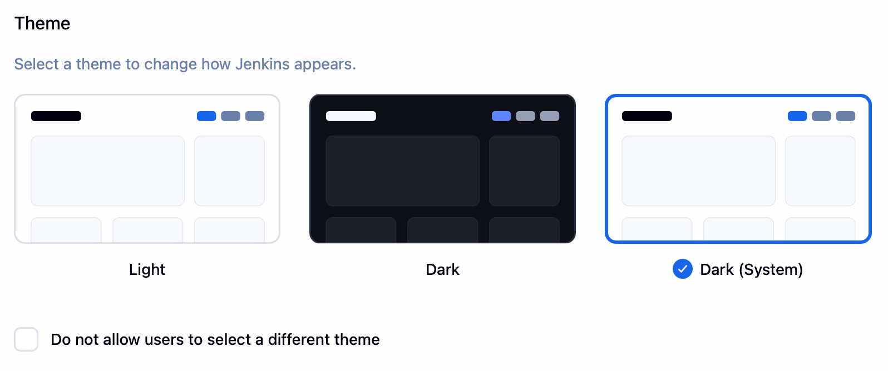

# Theme Manager plugin for Jenkins (Incubating)

[](https://ci.jenkins.io/job/Plugins/job/theme-manager-plugin/job/master/)
[](https://github.com/jenkinsci/theme-manager-plugin/graphs/contributors)
[](https://plugins.jenkins.io/theme-manager)
[](https://github.com/jenkinsci/theme-manager-plugin/releases/latest)
[](https://plugins.jenkins.io/theme-manager)

:exclamation: **Incubation Stage**: Currently this plugin is in the incubation stage.
It's possible there will be some breaking changes as it evolves.
You are welcome to try out this plugin and to provide your feedback.
Contributions are welcome!

## Introduction

Adds theme management to Jenkins, at a global or user level.

## Getting started

There's normally no need to install this plugin directly as the theme you install will depend on this.

First you will want to install a theme plugin through the Jenkins Update Center.

### Known themes

* [Dark theme](https://github.com/jenkinsci/dark-theme-plugin)
* [Dark theme (OS settings respected)](https://github.com/jenkinsci/dark-theme-plugin)

_Just send a pull request to add your theme to the list if create one_

### Configuring the plugin

You can configure this plugin globally, or each user can configure it in their configuration as well.

### Global

Manage Jenkins → Configure System → Built-in Themes



You can stop users from being able to change their theme by selecting the:
'Disable user theme override' option

### User

'Your name' profile link (in top right) → Configure → Built-in Themes


### Configuration as Code example

```yaml
unclassified:
  themeManager:
    disableUserThemes: true
    theme: "noOp" # noOp is no theme, change this to the name of the theme plugin you're using, i.g. 'darkSystem'
```

## Creating a new theme

See our [developer guide](docs/developer-guide.md).

## Contributing

Refer to our [contribution guidelines](.github/CONTRIBUTING.md).

## LICENSE

Licensed under MIT, see [LICENSE](LICENSE.md).
